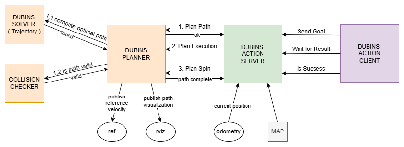

# Dubins Planner
This package implements Dubins-path planning, validation, and execution helpers for a differential-drive robot inside a ROS workspace. It provides:
  - A planner that computes shortest-feasible Dubins curves between two poses.
  - Collision checking utilities against polygonal and circular obstacles.
  - An action server/client pair to request following a planned Dubins path.


**Directory Structure**
```graphql
├── action/
│   └── FollowDubins.action       # Messages structures of the action
├── include/
│   ├── dubins_planner_client.h   # Library to export in system thet want to use the action
│   └── dubins_planner/           # Implemnt internal library
│       └── collision_checker.h   #`CollisionChecker` class and helper types.
│       └── dubins_planner.h      #`DubinsPlanner` class: high-level planner, execution and visualization helpers.
│       └── dubins_trajectory.h   # Low-level Dubins geometry, data structures and algorithms.
│
│
└── src/
    ├── dubins_planner_client.cpp   # Client class using the action client.
    ├── dubins_planner_server.cpp   # Server node implementing follow-and-execute behavior.
    └── library/   # implementation of library 


```


**Dubins Server Initialisation:**
1. Initialize a DubinsPlanner as core logic of the server
2. Read the Map and load it inside the DubinsPlanner 
3. Setup the Odom robot subcriber to be able to read the robot position
4. Activate the Action Server


**Dubins Server Work-Pipelin:**
1. It receive an action goal message that contain: goal pose, velocity and turning radio
PLANNING PHASE: 
2. Call the DubinsPlanner to plan a Dubins Curve from the current position ( get through the odometry subscriber ) to the goal pose following the velocity and turning radio constraint
3. Check that the Cuve is valid 
EXECUTION PHASE:
4. Keep active the spin() of the DubinsPlanner which:
  4.1 Extract the Reference pose for the controller
  4.2 Publish on the robot topi /ref the computed reference

<br>
<br>
<p align="center">
  
</p>
<br>
<br>

## Dubins Kinematic Planner Library
This library provides a Object-Oriented solution for optimal Dubins Path planning for autonomous robots with non-holonomic constraints. It calculates the shortest path between two poses $(x, y, \theta)$ while respecting a constant minimum turning radius $R$.

### 1. Core Components
**DubinsSolver**: The mathematical engine that solves the analytical equations for path generation.

**CollisionChecker**: A spatial validation module that checks path safety against cached circular and polygonal obstacles.

**DubinsPlanner**: High-level coordinator that manages planning, collision verification, and real-time reference interpolation.

### 2. Key Data Structures
All library elements are encapsulated within the Kinematics namespace to prevent symbol collisions:
- *Segment*: Represents a single part of the path (either a circular arc or a straight line).     
  - curvature ($k$): $>0$ for Left turn, $<0$ for Right turn, $0$ for Straight.
  - length: The distance along the segment.
- *Trajectory*: Holds the complete path, consisting of exactly 3 Segment objects and the pre-calculated total_length.
- *State*: A simple structure for robot pose $(x, y, yaw)$.

### 3. Main API Functions
**Kinematics::DubinsSolver**
- *compute_optimal_path(start, goal, result)*: Computes the shortest valid Dubins path. It tests all 6 primitives (LSL, RSR, LSR, RSL, RLR, LRL) and returns the most efficient one.
- *project_state(dist, x0, y0, yaw0, k, out)*: A core kinematic integration function that calculates a new pose after traveling a specific distance dist with a curvature k.

**CollisionChecker**
- *update_collision_cache(map)*: Pre-processes the environment map into optimized primitives for fast collision lookups.
- *is_dubins_path_valid(trajectory)*: Samples the trajectory at high resolution to ensure every point is clear of obstacles.

**DubinsPlanner**
- *planPath(...)* : Coordinates the solver and the collision checker to produce a safe, executable path.
- *spin(curr_x, curr_y, curr_th)*: The execution loop function. It calculates the instantaneous reference point based on the robot's current location.


